Final Project - Minesweeper
==============================

Final project for McCanny CS.

You are tasked with implementing several key functions for a game. 
After the project, you will have a playable Minesweeper game with GUI.

## Background

https://en.wikipedia.org/wiki/Minesweeper_(video_game)

The history of Minesweeper dates back to the 1900s. According to Eurogamer,
the first presentation of the game was called "Mine-out", written by Ian Andrew
(the founder of Incentive Software, who created one of the first 3D game engines, the Freescape rendering engine).
Later, Microsoft created their version and bundled the game with the Windows operating system, popularizing it.

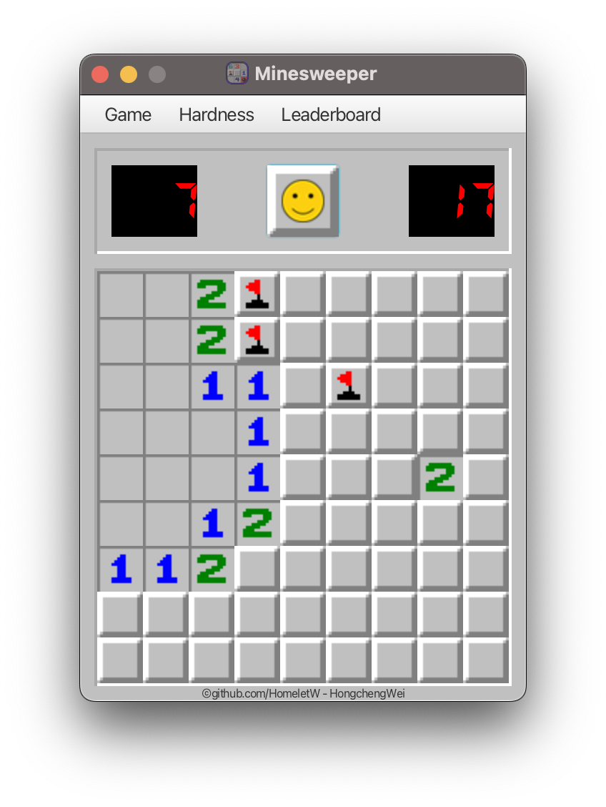

When the minesweeper game starts, the player is presented with a grid of minefields. Each block within the field could be a mine block or a regular block.
Initially, all blocks are hidden. The player can left-click to reveal a block or right-click to flag a block that they believe is a mine.

Flagging a block is not the same as revealing a block. When a mine block is revealed, the game is over, and the player loses.

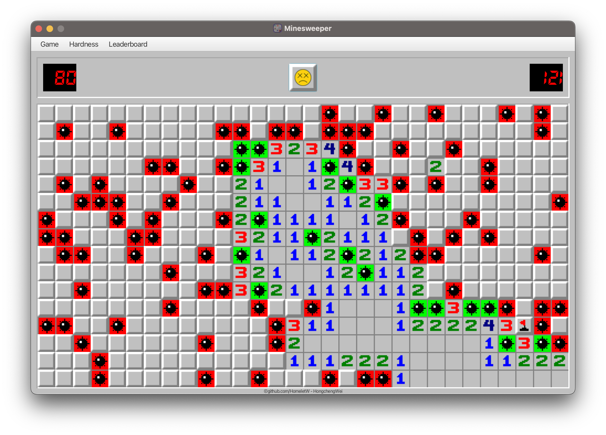

When a non-mine block is revealed, it shows the number of mine blocks around it (adjacent and diagonally).

The game's win condition is to flag all mine blocks within the field.

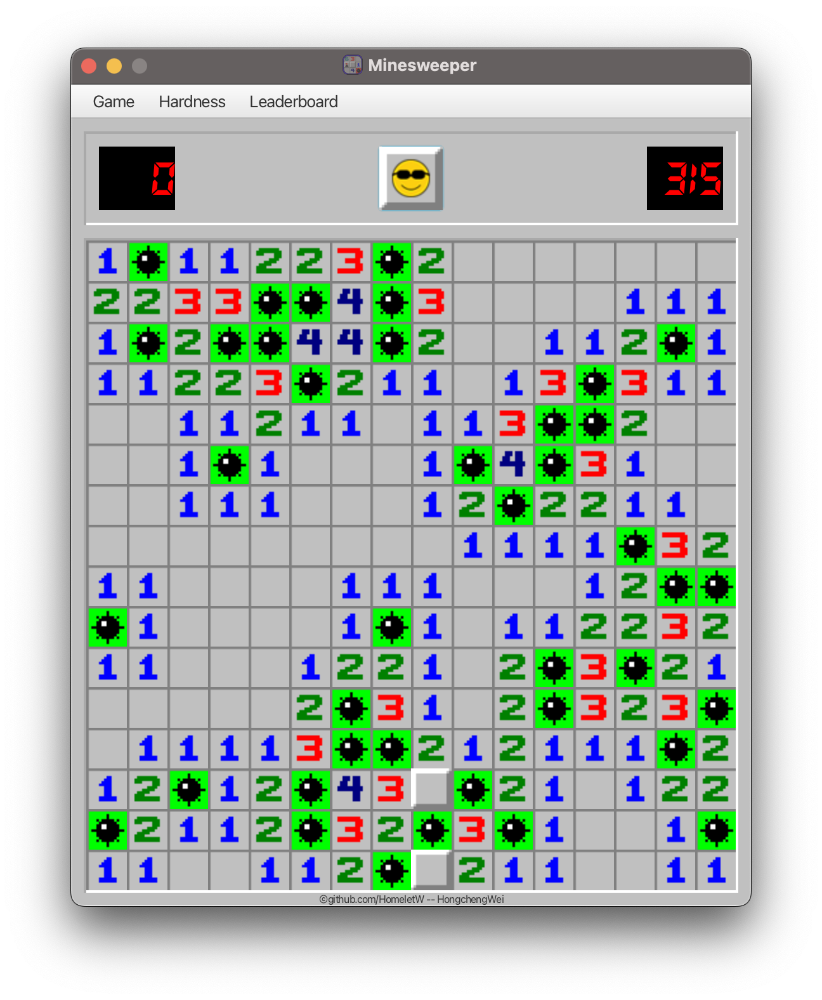

The game's hardness level determines the size and the number of mines within the board.

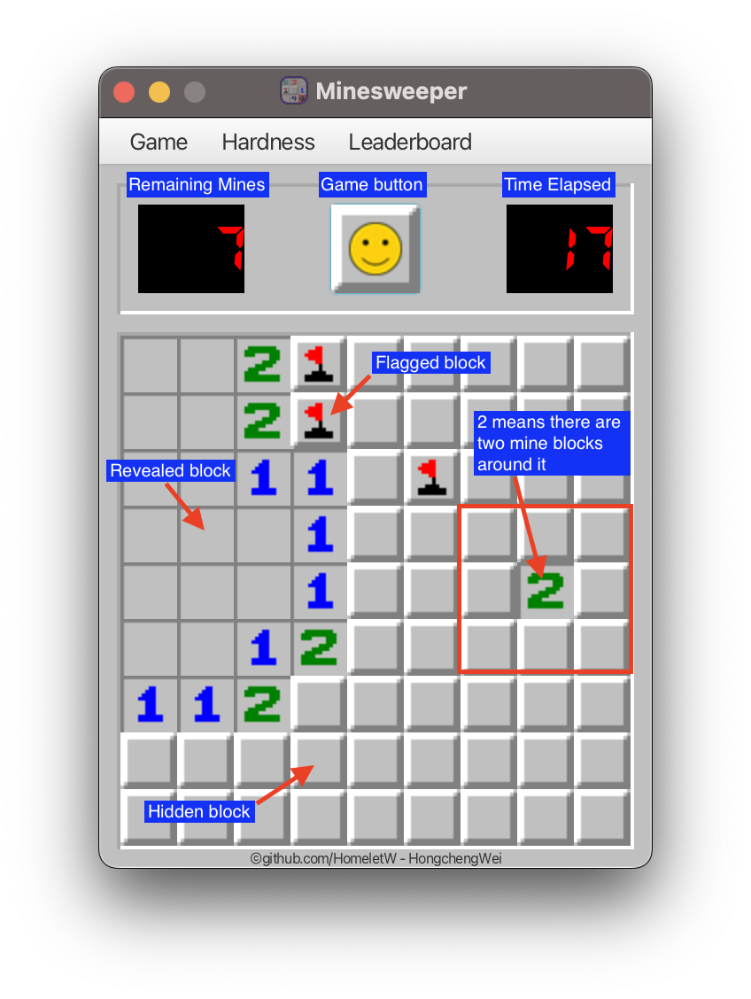

## Preparation

First you need to make sure have the following tools (Click on arrow to show the step on how to install).

<details>
<summary>
Download <strong>IntelliJ IDEA</strong>.
</summary>

Strongly recommend using IntelliJ as the IDE (integrated development environment).

Follow this link to download the Education Edition. Any IntelliJ Edition should work.

https://www.jetbrains.com/edu-products/download/#section=idea

---

</details>

<details>
<summary>
Download <strong>Java 11 JDK</strong> (must be Java 11).
</summary>

If you haven't downloaded that Java 11 JDK 
or you are not sure if you have the correct version (must be version 11),
follow these steps to download it through IntelliJ.

Open 'Project Structure' by selecting 'File' → 'Project Structure'.

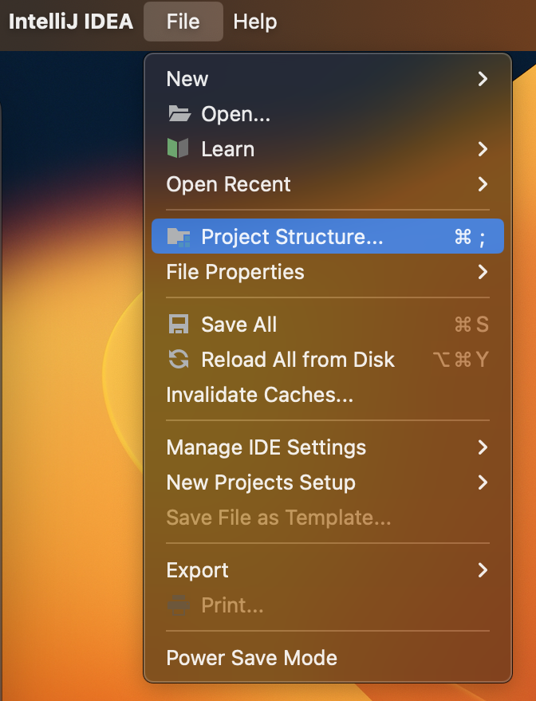

Then in 'Project Structure' window in the 'SDK' option to click on 'Add SDK' → 'Download JDK'.

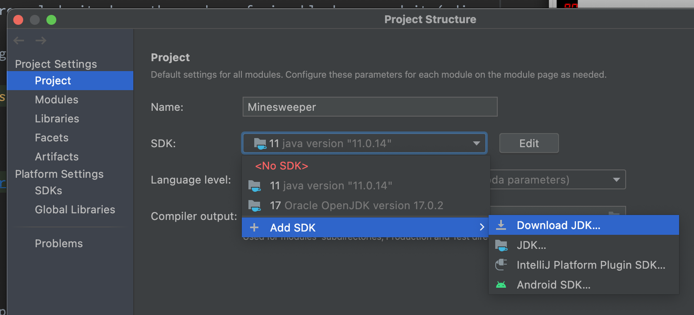

A popup of 'Download JDK' should be presented as follows.
__The important thing is to select '11' under the version dropdown.__
It should be fine which 'Vendor' you select (as long as the version is correct).
In this example, I'm going with 'Amazon Corretto'.

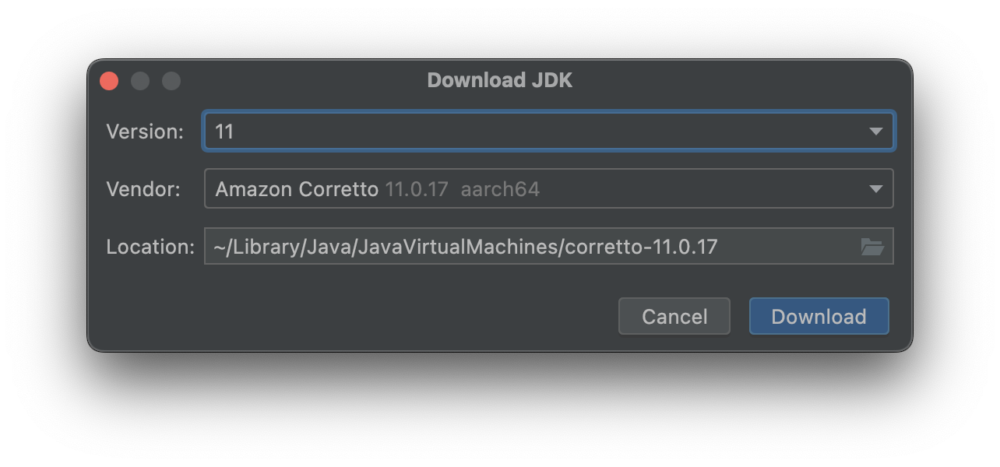

---

</details>

<details>
<summary>
Download <strong>Maven</strong>.
</summary>

Maven help us to install libraries that are required like JavaFX, Spring and JUnit.
Maven also help us to build the project and package it into a Runnable Jar file.

Following the guide here to install Maven on to your computer.

https://www.jetbrains.com/idea/guide/tutorials/marco-codes-maven/installing-maven/

Note this step may require some command line knowledge. 
If you don't know how to proceed, please reach out to your instructor for help.

---

</details>

After everything is downloaded and setup, you may download the final project code from GitHub as a zip or clone the repo through git.

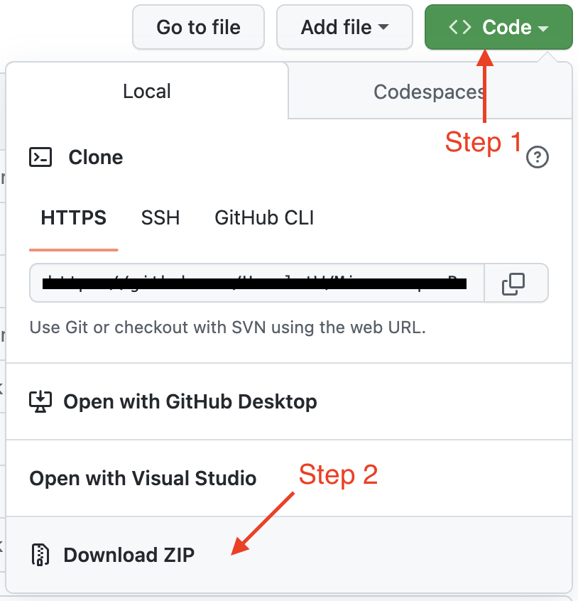

Open the project in IntelliJ by clicking 'Open' or 'Open from existing source' and select the project folder.

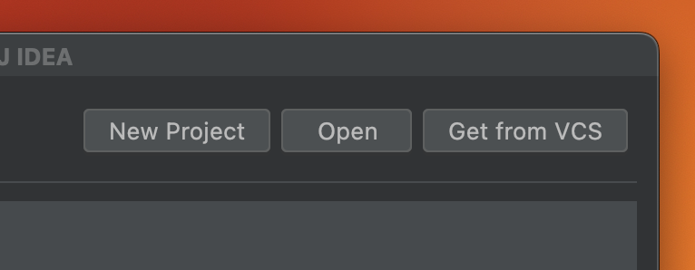

If you have everything setup correctly, intelliJ should do the rest of the work by 
automatically processing the project settings.

After IntelliJ does the initial processing, select the 'MinesweeperLauncher' run configuration.
Click on the _green play button_ on the top to run the program.

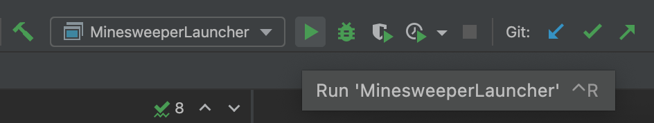

If you see the Minesweeper game window, you have completed the preparation step.

See [Troubleshooting](#Troubleshooting) if you have encountered problems.

## Marking Schema & Testing

You will be marked based on the number of test cases passed and code quality.

| Component     | Percentage |
|---------------|------------|
| Code Quality  | 30%        |
| Public Tests  | 35%        |
| Private Tests | 35%        |

Code quality contributes to 30% of your mark. This portion is marked by manually examining your code.
Here are the general criteria:
- (__5%__) The code compiles without error. As long as your code can run, you will earn this 5%.
- (__5%__) No change to the other code. You should not change any part of the code that you were not instructed to change.
- (__10%__) Code should be free of unspecified side effects (e.g. no `System.out.print` statements).
- (__10%__) Local variable names and documentation are used appropriately.
  - The local variable you declare within your function should have meaningful names and follow the `camelCase` naming convention.
  - If you want to write your helper function, you should add documentation to state the effect of the function clearly. Your documentation should contain the following:
    - The effect of the function.
    - The input parameters and output.
    - State the prerequisite if there is any.
  - Comments are not required, but it's nice to have them beside critical ideas.

<details>
<summary>Here is the documentation template of a helper function</summary>
<pre>
/**
 * Add two number together.
 *
 * Prerequisite: None
 *
 * @param a integer value
 * @param b integer value
 * @return the sum of a and b
 */
int add(int a, int b) { return a + b; }
</pre>
</details>

The rest of the marks (70%) are occupied by testing.
There are a total of 70 test cases (35 public tests, 35 private tests).
Each test case contribute to 1% of the mark towards final project.
E.g. if you pass all public test cases and meets all code quality checks, you will have at least 65/100.

### Tests

Public tests are provided for you to verify your implementation.
Note that general tests itself may not be sufficient to verify the correctness of your program,
there might be corner cases that aren't tested in the public tests.
You are welcome to add your test cases through JUnit, but this is not required.
Private tests are hidden from you.

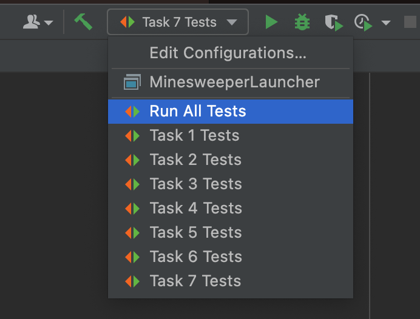

Select "Run All Tests" run configuration from the dropdown to run test cases, then click on the run button.
Or you may run the tests for a specific task by selecting the corresponding run configuration.

After the test runs, IntelliJ will show you the number of tests passed/failed and the reason for the failure.

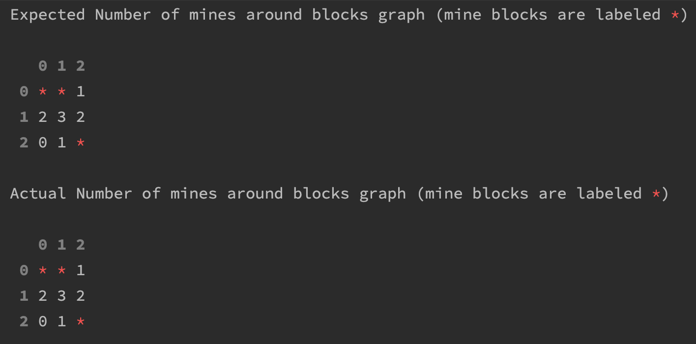

For most tests, the output shows you a graph of the expected board and the actual board based on your implementation, 
these are useful for debugging.

## Program Structure

In this section, we introduce the structure of our code. 

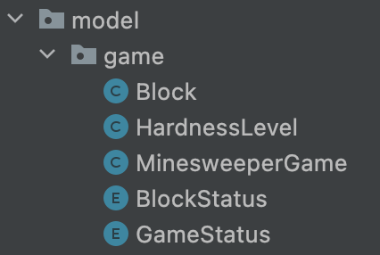

### HardnessLevel class

HardnessLevel class defines the parameters to use to create a MinesweeperGame.


The MinesweeperGame will have a board size of `boardHeight` x `boardWidth`, 
and with `numMines` mine block within it.

There are some predefined HardnessLevel:

- `HardnessLevel.EASY`: 9x9 board with 10 mines.
- `HardnessLevel.MEDIUM`: 16x16 board with 40 mines.
- `HardnessLevel.HARD`: 30x16 board with 99 mines.

### Block class and BlockStatus enum

Block class represents a block within the Minesweeper game board.

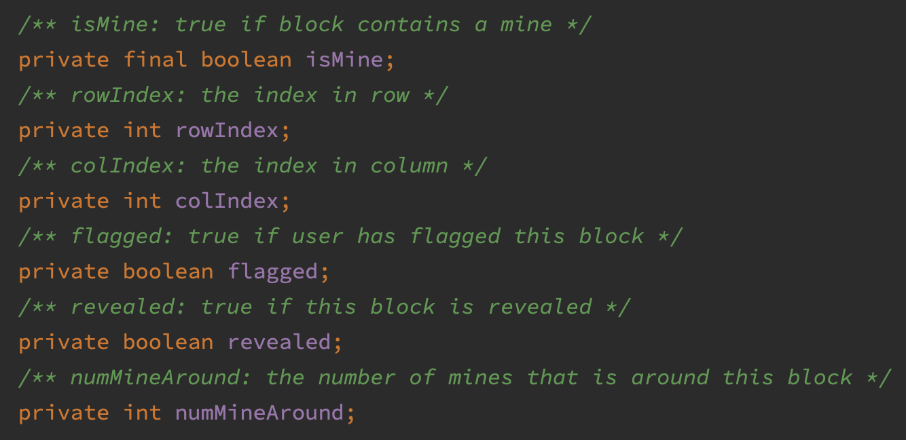

`isMine` is true if the block is a mine block. 
The block has a position (`rowIndex`, `colIndex`) on the board.
`flagged` is true if the block is flagged by user (through user right-click).
`revealed` is true if the block was revealed by the user left-click.

`numMineAround` is the number of neighbouring mine blocks (within the 3x3 neighbour).
This should be a value between 0~8. 
`numMineAround == 0` means no mine blocks are around this block.
`numMineAround == 8` means all blocks around this block are mines.

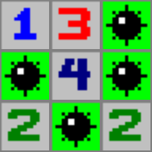

The numbers within each block of the above picture are the `numMineAround` values.

`BlockStatus` is an enum object that identifies all possible statuses of a block with
a corresponding value. [Task 1](#Task-1-GetBlockStatus) asks you to implement a method 
that translates the block's status to a `BlockStatus` value.

To read about [Enum in Java](https://www.w3schools.com/java/java_enums.asp).

### MinesweeperGame class and GameStatus enum

MinesweeperGame class represents the actual minesweeper game board.


`board` is the game board, represented by a 2D array of `Block`s.
The configuration of the game is determined by the HardnessLevel `level`.

You can ignore the `timeElapsed`, `pausing`, `surrender` instance variables.
They are not needed in the tasks.

The constructor of `MinesweeperGame` takes an `HardnessLevel` object as a parameter
and initialize the `board` 2D array with specified size.
Then the first `numMine` blocks in the `board` are created as mine blocks. 
[Task 2](#Task-2-FisherYatesShuffle) asks you to complete a famous uniform shuffling algorithms 
called the [Fisher-Yates Shuffle](https://en.wikipedia.org/wiki/Fisher%E2%80%93Yates_shuffle).

[Task 3](#Task-3-GetAvailableFlags) asks you to count the number of flags that is 
available for the user.

[Task 4](#Task-4-CountMinesAround) asks you to implement the function that 
count the number of mine block around a certain block in the `board`.

[Task 5](#Task-5-HasUnFlaggedMine) and [Task 6](#Task-6-HasRevealedMine) are used
to translate the current status of the game to an `GameStatus` enum value (WIN or LOSE or PLAYING or PAUSING).

[Task 7](#Task-7-RevealBlock) asks you to implement what happens when the user left-clicks on a block.
Recall that left-click on a block in Minesweeper game reveals the block and the
neighbouring blocks if there are no mine blocks around the block.
This process is also known as [Flood Fill](https://en.wikipedia.org/wiki/Flood_fill) 
which is also used in the PhotoShop paint bucket tool.

## Tasks

There are a total of 7 core functions that you need to implement.

Everything you need to change is in this two files:
- src/main/java/homelet/mccanny/minesweeper/model/game/Block.java
- src/main/java/homelet/mccanny/minesweeper/model/game/MinesweeperGame.java

The tasks are marked with `# TODO` in these files to help identify where to change.

You should:
- __NOT__ change other files, or 
- __NOT__ add/remove any instance variables in any files, or
- __NOT__ modify any constructors' definition, or
- __NOT__ remove/change any of the existing helper functions.
- __NOT__ change any public/private test function or files that are provided to you, or
- __NOT__ change any part of the file that is marked with `DO NOT TOUCH`.

Violation of these will result in a deduction of the mark from Code Quality.

The functions defined under the `helper functions` section are functions you may call.
It would be best to look at the documentation of these helper functions before using them. 

If you want to add your own helper functions, you should add them in the `helper functions` section 
and clearly document what it does. 
### Task 1 GetBlockStatus

<details>
<summary>
This task requires you to implements the <code>getBlockStatus</code> function from <code>Block.java</code>.
</summary>

| Parameter           | Description                                   |
|---------------------|-----------------------------------------------|
| `bool gameFinished` | true if the game is finished, false otherwise |

Returns the status of this block as a `BlockStatus` enum value.
The status of the block behaves differently depending on if the game finished or not.

- if game is not finished:
  - flagged blocks should return `BlockStatus.FLAGGED`
  - revealed block should return  (`BlockStatus.M_0`, ..., `BlockStatus.M_8`) depending on the value of numMineAround
    - `numMineAround == 0`, returns `M_0`, and etc.
    - Note: you should call the helper function `getMineAroundStatus` for this.
  - otherwise, should return `BlockStatus.HIDDEN`
- if game is finished:
  - flagged mine blocks should return `BlockStatus.MINE_CORRECT`
  - not flagged mine blocks should return `BlockStatus.MINE_WRONG`
  - non-mine blocks are handled the same as the game not finished.

</details>

### Task 2 FisherYatesShuffle

<details>
<summary>
This task requires you to implements the <code>fisherYatesShuffle</code> function from <code>MinesweeperGame.java</code>.
</summary>

No parameters. No return value.

Shuffle the board according to the below pseudocode, which describes one version of the Fisher-Yates Shuffle Algorithm.

```text
n ← boardWidth * boardHeight
For each block with flattened index i in [0, n−2] do
     j ← random integer such that i ≤ j < n
     swap board[i] and board[j]
```

The majority of the algorithms are implemented for you. Your job is to set `j` to generate
a random number within range `[i, n)`.

Note, you __MUST__ use the `random` helper function defined in `MinesweeperGame` instead of
calling `Math.random()`. The functionality of the two is the same.

</details>

### Task 3 GetAvailableFlags

<details>
<summary>
This task requires you to implements the <code>getAvailableFlags</code> function from <code>MinesweeperGame.java</code>.
</summary>

No parameters. Returns the number of flags available for the user. 

The available flag is calculated as:

```java
level.getNumMines() - numFlaggedBlock;
```

Your job is to calculate `numFlaggedBlock`: the number of blocks that `isFlagged()`.

Hint: use a nested for loop to loop through all blocks in `board` and increment `numFlaggedBlock` by 1
if `block[rowIndex][colIndex].isFlagged()` is true.

</details>

### Task 4 CountMinesAround

<details>
<summary>
This task requires you to implement <code>countMinesAround</code> function from <code>MinesweeperGame.java</code>.
</summary>

| Parameter      | Description                                     |
|----------------|-------------------------------------------------|
| `int rowIndex` | an index to the first dimension of the `board`  |
| `int colIndex` | an index to the second dimension of the `board` |

Precondition: `(rowIndex, colIndex)` is a valid position.

Return the number of mine blocks around `(rowIndex, colIndex)`.

Hint: use the `getBlockAround` helper function to get an ArrayList of adjacent blocks around 
position `(rowIndex, colIndex)`. Use a for loop to count the numbers of blocks that `isMine()`.

</details>

### Task 5 HasUnFlaggedMine

<details>
<summary>
This task requires you to implement the <code>hasUnFlaggedMines</code> function from <code>MinesweeperGame.java</code>.
</summary>

No parameters. Returns true if there is an unFlagged mine block in the `board`, otherwise returns false.

Hint: use a nested for loop to loop through all blocks in the `board`. 
Immediately returns true if a block `isMine()` and not `isFlagged()`.
If the loop finished without return, it means there are no mine blocks are not flagged.
In other words, all mine blocks are flagged. Therefore, return false.

</details>

### Task 6 HasRevealedMine

<details>
<summary>
This task requires you to implement the <code>hasRevealedMine</code> function from <code>MinesweeperGame.java</code>.
</summary>

No parameters. Returns true if there is a revealed mine block in the `board`, otherwise returns false.

Hint: similar to Task 5, use a nested for loop to loop through all blocks in the `board`.
Immediately returns true if a block `isMine()` and `isRevealed()`.
If the loop finished without return, it means there are no mine blocks are revealed.
In other words, all mine blocks are not revealed. Therefore, return false.

</details>

### Task 7 RevealBlock

<details>
<summary>
This task requires you to implement the <code>revealBlock</code> function from <code>MinesweeperGame.java</code>.
</summary>

| Parameter      | Description                                     |
|----------------|-------------------------------------------------|
| `int rowIndex` | an index to the first dimension of the `board`  |
| `int colIndex` | an index to the second dimension of the `board` |

Precondition: `(rowIndex, colIndex)` is a valid position.

No Return value. `revealBlock` is called when the user left-clicks on a block. The action is described as pseudocode below.

```text
blk ← board at (rowIndex, colIndex)
If blk.revealed OR blk.flagged, then
    do nothing and Return;
Else
    blk.revealed ← TRUE;
    If there are no mines blocks around blk AND NOT blk.isMine, then
        For each adjacent block around blk do
            Recursively Reveal adjacent block;
```

In words: reveals the block if it is not revealed or flagged, then also recursively reveals the
neighbouring blocks if there are no mine blocks around this block and this block is not a mine block.

Note & Hints: 
- You should use the corresponding getter/setter for `blk.revealed`, `blk.flagged`, and `blk.isMine`.
- Consider using `blk.numMineAround` or `countMinesAround` you implemented in Task 4 to check if there are any mine blocks around `(rowIndex, colIndex)`.
- Consider using the helper function `getBlocksAround` to get an ArrayList of adjacent blocks around `(rowIndex, colIndex)`.

</details>

## Troubleshooting

Check the following:
- Do you have Java 11 installed? (must be Java 11)
  - Follow [preparation](#Preparation) to set up the JDK.
- Is your project configured to use Java 11?
  - Select the Java 11 from `Project Structure`.

Here are some common error that you may run into.

<details>
<summary>The game is not responding to click.</summary>

The game is not expected to work unless all core functions are implemented.
After you completes all tasks correctly, the game will fully work.

</details>

<details>
<summary>Problem with Apple M1 Mac</summary>

This is a known issue with Apple Silicon. You need to make the following change to `pom.xml` file.

```xml
<dependency>
  <groupId>org.openjfx</groupId>
  <artifactId>javafx-controls</artifactId>
  <version>19</version>
  <!--Uncomment the following line if you have Apple Silicon-->
  <classifier>mac-aarch64</classifier>
</dependency>
<dependency>
  <groupId>org.openjfx</groupId>
  <artifactId>javafx-fxml</artifactId>
  <version>19</version>
  <!--Uncomment the following line if you have Apple Silicon-->
  <classifier>mac-aarch64</classifier>
</dependency>
```

After that, you should reload the maven project by clicking on this button
floating in the top-left corner of the window.


</details>

For additional help, contact your instructor.
